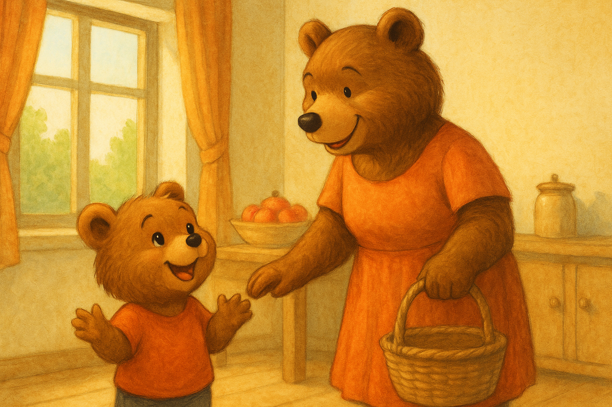

## Chapter 1 – Cirillo’s Dream

Cirillo was a little bear cub with honey-colored fur and eyes as bright as two shining buttons.  
He lived with Mama Bear in a wooden house at the edge of the great forest, a quiet place where days passed by with the smell of freshly baked cookies and the songs of little birds.

Every morning, Cirillo woke up early.  
He had breakfast with warm milk and honey, then helped his mom hang out the laundry or sweep the yard.  
Sometimes he would draw with colored pencils, filling the pages with castles, dragons, and snow-covered mountains.  
Other times, he pretended to be an explorer, discovering every corner of the garden.

But that day was not just any day.  
Mama Bear had a special smile on her face and, while preparing breakfast, she announced:

> "Cirillo, today we’re going to the market in the city!"

Cirillo’s eyes sparkled like stars.  
The market! That magical place he had heard about so many times: stalls full of fragrant fruit, colorful fabrics, and above all, **toys of every kind**.  
He had always imagined mountains of spinning tops, wooden trains, teddy bears bigger than himself, and kites dancing in the sky.

“Mom, mom! Will there be wooden drums? And rocking horses? And… and building blocks?”  
Cirillo hopped around the room, unable to stand still.

> "There will be a little bit of everything, but remember, my little one: at the market you must stay close and not run off."

Cirillo nodded… at least on the outside.  
Inside, he was already dreaming of running between the stalls, his nose full of scents and his little paws not knowing which treasure to grab first.

After breakfast, Mama Bear put on his little blue scarf and his cap with the pompom.  
Cirillo grabbed his mom’s paw, and together they set off towards the city, the little bear’s heart beating fast with excitement.

That day, the sun shone high and the road to the market seemed shorter than usual.  
Cirillo, clutching his mom’s paw, thought only of one thing: **the toys**.  
He didn’t yet know that this day would teach him a lesson he would never forget.

