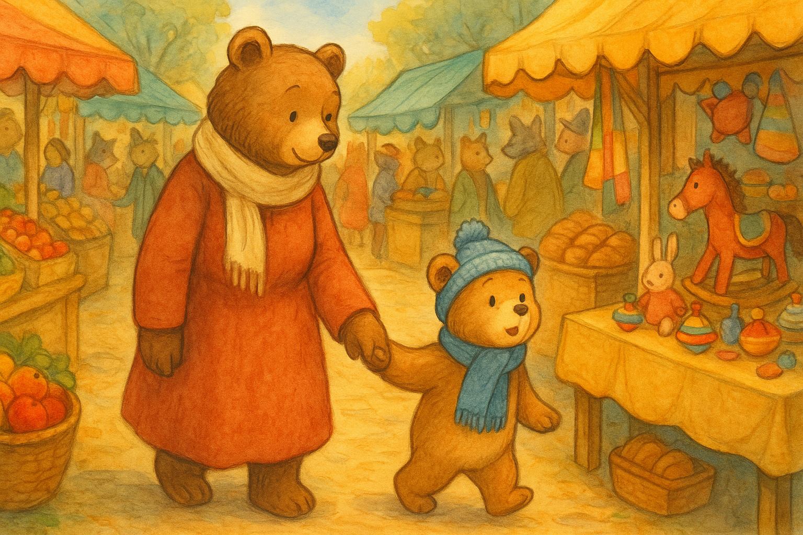

## Chapter 2 – Among the Stalls

The city market was a feast of colors and scents.  
The stalls lined up one after another like a living mosaic: towers of shiny red apples, baskets of warm bread smelling of the oven, fabrics swaying like sails in the wind.

Cirillo walked beside Mama Bear, his eyes wide open and his head turning left and right, trying to take in every detail.  
Then, suddenly, he saw something that made him jump: **a stall full of wooden toys**.

There were little trains, spinning tops, puppets, drums, and even a red-painted rocking horse.  
Cirillo felt his heart race wildly.

“Mom! I want to see the toys! Now!”

> "Wait, Cirillo, first we need to buy bread and fruit," Mama Bear replied calmly, holding his paw tight.

But Cirillo began to pull and kick.  
“Nooo! I want the toys now!”

Mama tried to distract him, but the little bear was far too excited.  
Suddenly, with a quick movement, he **slipped his paw out of his mother’s** and ran off into the crowd.

> "Cirillooo! Come back here right now!" shouted Mama Bear, but her voice was lost among the sellers’ calls and the chatter of the people.

Cirillo ran and ran, convinced he would find the toy stall.  
But the more he squeezed through the crowd, the more he realized he didn’t recognize the way.  
The stalls were all different, yet all the same.  
His excitement began to turn into a small knot of fear.

He stopped in the middle of the square.  
He could no longer see Mama Bear.  
He didn’t know where the toy stall was.  
And all around him, the crowd seemed like a river pushing him here and there.

“Oh no… what now?” he thought, his heart beating faster.

It was then that a deep, rough voice called out to him:  
> "Hey, little one… are you lost?"

Cirillo turned around.  
In front of him stood **a big, imposing bear**, with dark fur and a stern look.  
He wore a worn-out coat and kept his hands in his pockets.

> "Come with me. I’ll take you home. I know where to go."

Cirillo hesitated.  
Something in the bear’s tone didn’t convince him.  
But he was alone, and he didn’t know what to do.  
And as the sun began to set over the market stalls, his little adventure was about to become something much more serious.

