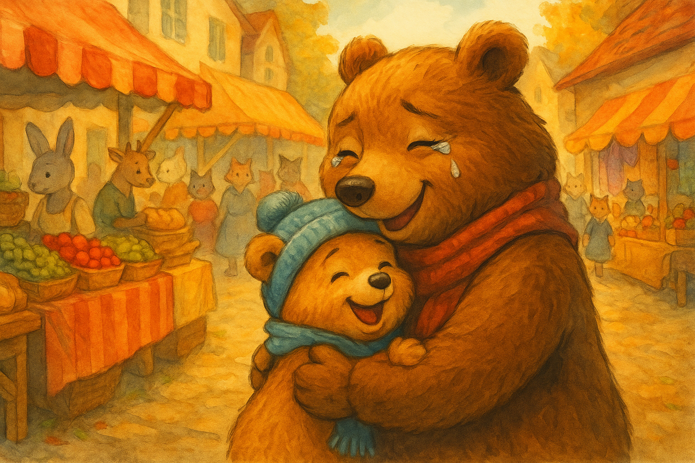

## Chapitre 3 – Retrouvailles

Maman Ourse courait entre les étals, le souffle court et les yeux pleins de larmes.  
> "Avez-vous vu un petit ourson, au pelage couleur miel, avec une écharpe bleue ?"  
Elle le demandait à chaque marchand, à chaque passant, mais tous secouaient la tête.

Le marché, qui auparavant semblait joyeux et animé, était pour elle désormais un labyrinthe chaotique.  
Le bruit des voix, l’odeur du pain chaud — tout s’était transformé en un bourdonnement confus.  
L’idée que Cirillo soit seul et effrayé lui serrait le cœur comme un étau.

Pendant ce temps, Cirillo marchait lentement aux côtés du grand ours sombre.  
Il avait décidé de ne pas s’opposer, mais il sentait que quelque chose n’allait pas.  
Cet ours parlait peu, et quand il le faisait, c’était d’une voix glaciale.

> "Alors, tu viens ? Nous ne voulons pas faire attendre," dit l’ours en tendant une patte.

Cirillo recula d’un pas.  
« Je… je dois retrouver ma maman… » murmura-t-il d’une voix tremblante.

L’ours fronça les sourcils, mais avant qu’il ne puisse dire un mot de plus, une voix familière et puissante rompit le vacarme du marché :  
> "MON FILS ! OÙ ES-TU PASSÉ ?"

Cirillo se retourna brusquement.  
Maman Ourse courait vers lui, les bras ouverts, le visage couvert de larmes.  
En un instant, le petit ourson se détacha du mauvais ours et se jeta dans ses bras.

« Maman ! Maman ! » pleura Cirillo en la serrant fort.  
« Je ne te quitterai plus jamais, je le promets ! J’ai eu tellement peur… je serai sage, je te jure ! »

Maman Ourse le serra fort contre elle, en caressant sa tête.  
> "Ça va, mon petit. L’important, c’est que tu sois en sécurité."

Le grand ours, voyant cette scène, fit un pas en arrière et disparut dans la foule.  
La maman prit la patte de Cirillo et, ensemble, ils se mirent en route vers la maison, loin du vacarme du marché.

Et ce soir-là, sous sa couverture chaude, Cirillo se rappela la leçon la plus importante de sa vie :  
**quand on est petit, il ne faut jamais s’éloigner de sa maman.**

