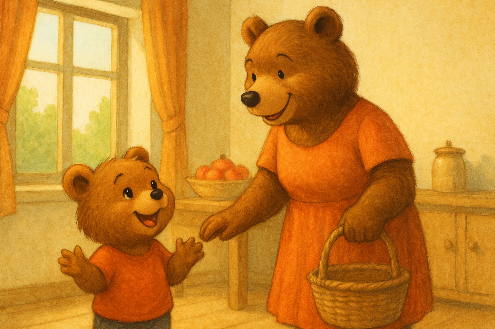

# Cirillo e il Mercato dei Sogni

## Capitolo 1 – Il sogno di Cirillo

Cirillo era un piccolo orsetto dal pelo color miele e dagli occhi vivaci come due bottoni luccicanti.  
Viveva con mamma Orsa in una casetta di legno ai margini della grande foresta, un luogo tranquillo dove le giornate scorrevano tra il profumo dei biscotti appena sfornati e il canto degli uccellini.

Ogni mattina, Cirillo si svegliava presto.  
Faceva colazione con latte caldo e miele, poi aiutava la mamma a stendere il bucato o a spazzare il cortile.  
A volte, si metteva a disegnare con le matite colorate, riempiendo i fogli di castelli, draghi e montagne piene di neve.  
Altre volte giocava a far finta di essere un esploratore, scoprendo ogni angolo del giardino.

Ma quel giorno non era un giorno qualsiasi.  
Mamma Orsa aveva un sorriso speciale stampato sul muso e, mentre preparava la colazione, annunciò:

> "Cirillo, oggi andiamo al mercato in città!"

Gli occhi di Cirillo si illuminarono come stelle.  
Il mercato! Quel posto magico di cui aveva sentito parlare tante volte: bancarelle piene di frutta profumata, stoffe colorate e, soprattutto, **giochi di ogni tipo**.  
Aveva sempre immaginato montagne di trottole, trenini di legno, orsacchiotti più grandi di lui e aquiloni che danzavano nel cielo.

«Mamma, mamma! Ci saranno i tamburi di legno? E i cavallucci a dondolo? E… e le costruzioni?»  
Cirillo saltellava per la stanza, incapace di stare fermo.

> "Ci sarà un po' di tutto, ma ricorda, piccolo mio: al mercato bisogna stare vicini e non correre via."

Cirillo annuì… almeno in apparenza.  
Dentro di sé, già sognava di correre tra le bancarelle, con il naso immerso nei profumi e le zampette che non sapevano quale tesoro afferrare per primo.

Terminata la colazione, mamma Orsa gli mise la sua sciarpina azzurra e il cappellino con il pompon.  
Cirillo afferrò la zampa della mamma, e insieme si avviarono verso la città, con il cuore dell’orsetto che batteva forte per l’emozione.

Quel giorno, il sole splendeva alto e la strada verso il mercato sembrava più breve del solito.  
Cirillo, stringendo la zampa della mamma, pensava solo a una cosa: **i giochi**.  
Non sapeva ancora che quella giornata gli avrebbe insegnato una lezione che non avrebbe mai dimenticato.

