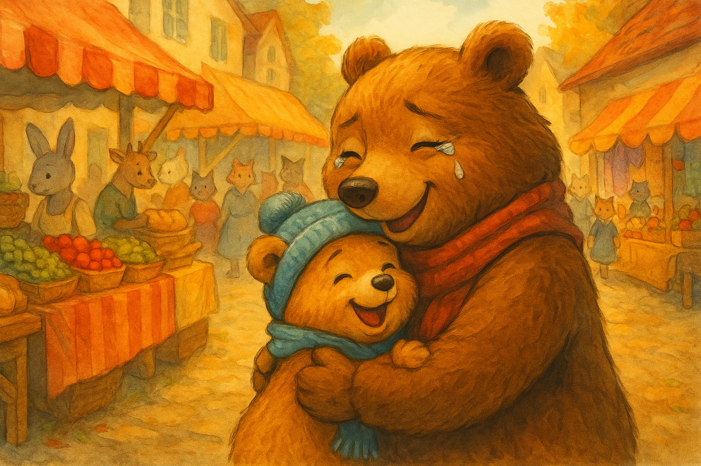

## Capitolo 3 – Il ritrovamento

Mamma Orsa correva tra le bancarelle, il fiato corto e gli occhi pieni di lacrime.  
> "Avete visto un piccolo orsetto, pelliccia color miele, con una sciarpa azzurra?"  
Chiedeva a ogni venditore, a ogni passante, ma tutti scuotevano la testa.

Il mercato, che prima sembrava allegro e vivace, ora per lei era un labirinto caotico.  
Il rumore delle voci, il profumo del pane caldo, tutto si era trasformato in un brusio confuso.  
Il pensiero che Cirillo fosse da solo, spaventato, le stringeva il cuore come una morsa.

Nel frattempo, Cirillo camminava piano accanto all’orso grande e scuro.  
Aveva deciso di non opporsi, ma sentiva che qualcosa non andava.  
Quell’orso parlava poco, e quando lo faceva, lo faceva con voce fredda.

> "Allora, vieni? Non vogliamo far aspettare," disse l’orso, allungando una zampa.

Cirillo indietreggiò di un passo.  
«Io… io devo trovare la mia mamma…» mormorò con voce tremante.

L’orso aggrottò le sopracciglia, ma prima che potesse dire altro, una voce familiare e potente ruppe il frastuono del mercato:  
> "FIGLIO MIO! DOVE SEI ANDATO?"

Cirillo si voltò di scatto.  
Mamma Orsa correva verso di lui, le braccia aperte, il viso rigato dalle lacrime.  
In un attimo, l’orsetto si staccò dall’orso cattivo e si gettò tra le sue braccia.

«Mamma! Mamma!» pianse Cirillo, stringendola forte.  
«Non ti lascerò più, lo prometto! Ho avuto tanta paura… farò il bravo, giuro!»

Mamma Orsa lo tenne stretto, accarezzandogli la testa.  
> "Va bene, piccolo mio. L’importante è che tu sia al sicuro."

L’orso grande, vedendo quella scena, fece un passo indietro e sparì tra la folla.  
La mamma prese la zampa di Cirillo e insieme si avviarono verso casa, lontano dal frastuono del mercato.

E quella sera, sotto la coperta calda, Cirillo ricordò la lezione più importante della sua vita:  
**non ci si deve mai allontanare dalla mamma quando si è piccoli.**

