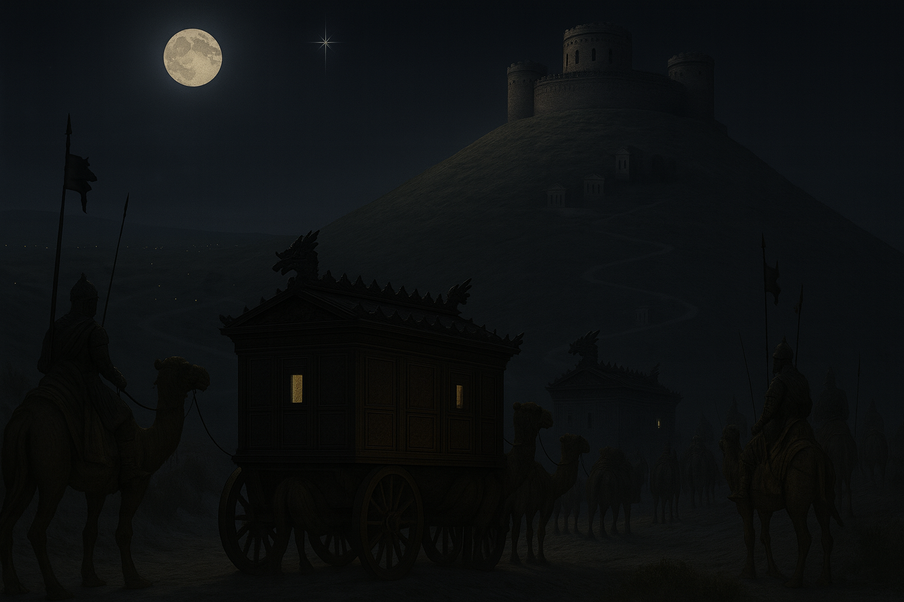
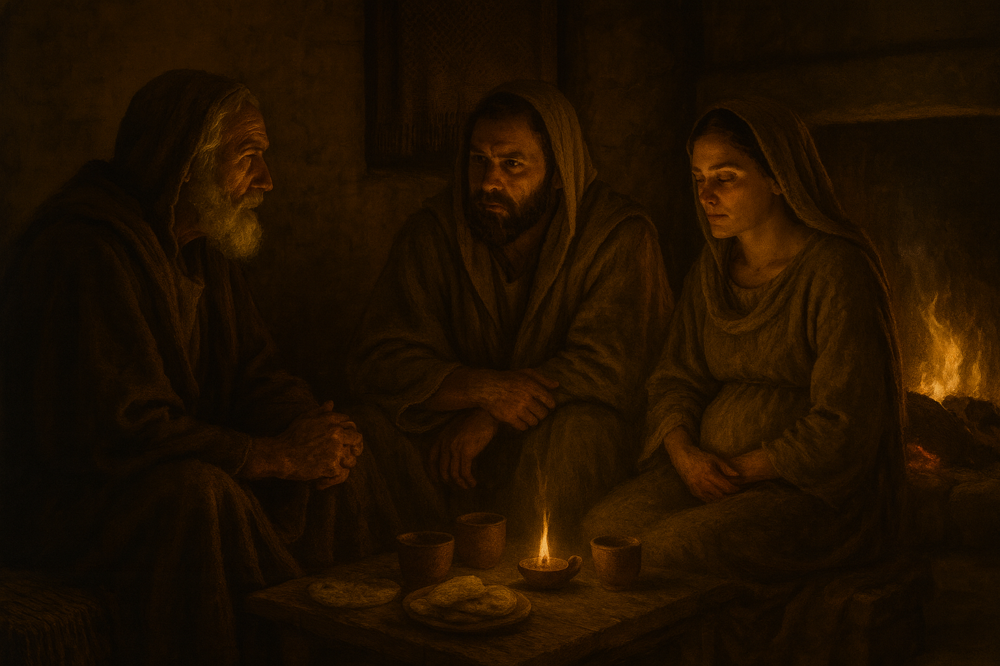
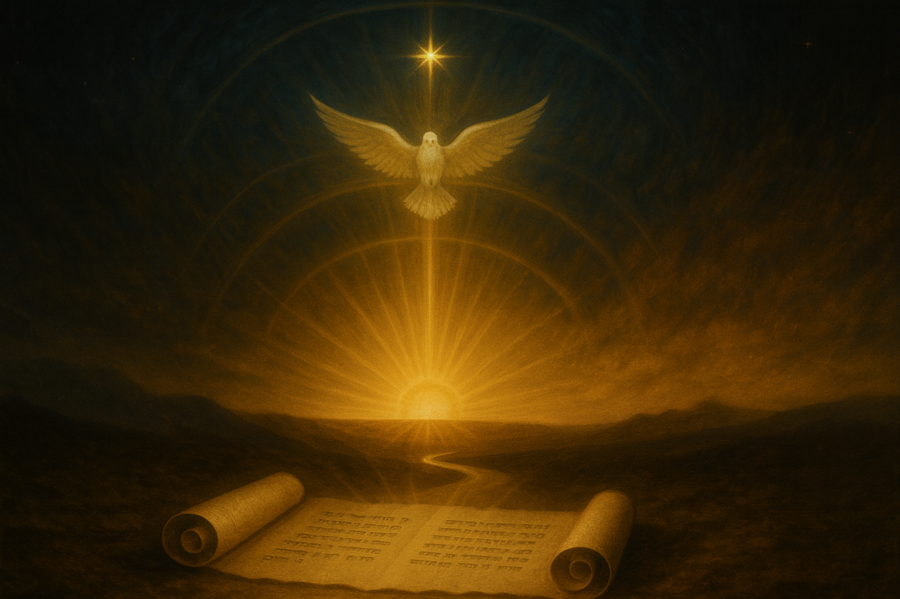
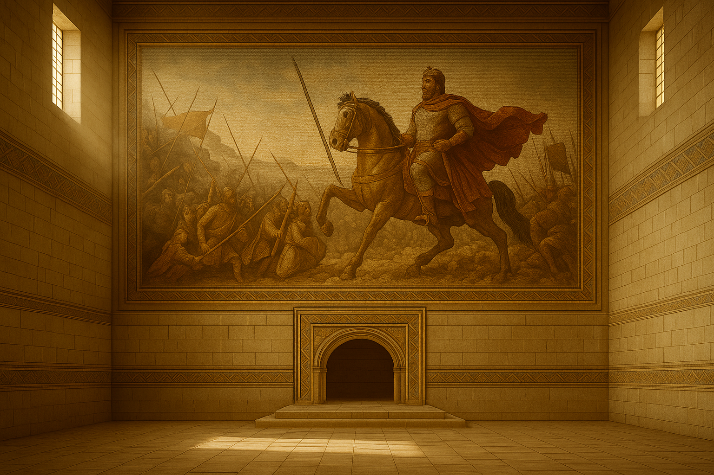

#### 1 Febbraio 6 A.C. (3 Adar I 3754)

Un lieve cigolio. Le ruote del carro, guidato da Mahil, rallentarono fino a fermarsi. Sporgendosi, con un cenno della mano, comandò all’intera carovana di arrestarsi; davanti a lui, l’imponente fortezza, l’Herodion. Si stiracchiò, stendendo e piegando le gambe, per sciogliere la rigidità del lungo viaggio, poi si girò, salì tre gradini e bussò alla porta del carro con decisione.\
*«Siamo arrivati». Vahid, dall'interno, scostò la sbarra e aprì. «Venite fuori!».*\
Mahil continuò a sgranchirsi ed entrò.\
*«Da qui, il panorama è eccezionale».*\
Baldassarre, con un movimento pigro, si affacciò da una feritoia.\
*«Beh, dai tuoi racconti mi aspettavo qualcosa di meglio... La luna piena e la stella che ci ha guidato danno un tocco magico, ma, se i miei occhi non mi ingannano, c’è solo qualche campo coltivato, degli oliveti, e semplici case di contadini». Sospirò. «Non è paragonabile alla varietà della nostra terra». Sospirò ancora. «Scopri se Erode può riceverci. La notte è già avanzata, e non vorrei rendere vano l’aver viaggiato anche di giorno. I cammelli non ce lo perdonerebbero».*\
Un urlo da fuori: *«chi siete?»*\
Vahid raccolse la spada da terra e allacciò il cinturone.\
*«Si stanno schierando qua fuori. Andiamo insieme, Mahil».*\
Baldassarre si voltò verso Vahid.\
*«No, andrà solo Mahil. Meglio non presentarsi come degli estranei armati. Siamo già arrivati con i tuoi sei carri che sembrano fortezze. Non voglio guai».*\
*«Come desidera maestà»* disse Vahid, chinando la testa e rimettendosi seduto.\
Mahil si apprestò a eseguire l’ordine.\
Un secondo urlo: *«Identificatevi immediatamente!»*\
Vahid scattò in piedi, portando la mano sulla spada. Mahil lo bloccò e indicò di far silenzio.\
*«Seguiamo quello che ci dice il maestro. Ai convenevoli ci penso io».*\ 
Uscì molto lentamente dal carro con le mani ed i palmi bene in vista.\
*«Eccomi. Sono Mahil Zophar».*\
Guardando intorno, notò che le guardie avevano circondato tutti i carri. Prese un respiro profondo e a voce molto alta disse:\
*«Veniamo in pace… I Magi di Ahura Mazda sono finalmente giunti! Chiediamo udienza immediata ad Erode il grande».*

Le massicce porte dell'Herodion iniziarono a muoversi con uno stridio metallico che echeggiò per tutta la vallata. Simeone corse alla finestra, scostò la tenda in pelle e afferrò le sbarre talmente forte che le sue mani divennero rosse.\
*«Chi può essere a quest'ora? Che siano arrivati i babilonesi?» mormorò, scrutando l'orizzonte.*\
Si precipitò subito fuori, aprì la porta e sobbalzò: di fronte due figure incappucciate che si ritrassero timidamente. Una si tolse immediatamente il cappuccio.\
*«Shalom! Amico».*\
Simeone aggrottò la fronte, il suo sguardo divenne tagliente come una lama.\
*«Entrate. Subito».*\
Li afferrò per un braccio e li tirò dentro senza dare loro il tempo di rispondere. Poi chiuse la porta con un colpo secco e abbassò la sbarra.\
*«Ma che succede? Perché ci tratti così?» protestò l’uomo, con voce rotta. «Sono io, Zaccaria!»*\
Simeone avanzò di un passo, il petto sollevato dal respiro irregolare.\
*«Zaccaria, è proprio perché ti conosco che vi ho tirato dentro immediatamente. Erode ti sta cercando ovunque, lo sai?»*\
Zaccaria trasalì.\
*«Erode… perché?»*\
Simeone batté il palmo sul tavolo con uno schiocco secco. Una briciola di pane saltò nell’aria, l’acqua nel bicchiere tremò.\
*«Dimmelo tu il perché!»*\
Zaccaria abbassò lo sguardo, cercando istintivamente la mano di Elisabetta. Lei, con un gesto dolce ma deciso, si sottrasse e posò il palmo sulla pancia, iniziando a massaggiarla. Zaccaria si inumidì le labbra.\
*«Ho detto… ho detto che ero nel tempio, intento a bruciare l'incenso, quando un brivido mi ha attraversato la schiena. Poi, una voce mi ha parlato. Mi ha annunciato che io ed Elisabetta avremmo avuto un figlio. Giovanni».*\
*«E quella voce? Chi era?» Zaccaria si costrinse a sollevare gli occhi.*\
*«Ho detto che era… l’angelo Gabriele».*\
Un secondo colpo di mano sul tavolo. Stavolta, il bicchiere rovesciò parte del suo contenuto.\
*«Zaccaria!» esclamò Simeone, il volto tirato dalla tensione.*\
«Ti avevo detto di limitarti a dire che tua moglie era incinta. Perché hai parlato di un angelo?»\
Le spalle di Zaccaria si piegarono, il respiro gli si spezzò in gola. Gli occhi gli si inumidirono, ma non alzò una mano per asciugarseli.\
*«Lo so… ho sbagliato».*\
La voce era poco più di un soffio.\
*«Dopo che la notizia si è diffusa, la gente ha iniziato a venire a casa nostra, chiedendo del miracolo. Troppi, sempre di più. Era impossibile negare. Ho finto di essere muto, ma non è servito. Alla fine, siamo fuggiti».*\
Simeone lo afferrò per le spalle, costringendolo a restare fermo.\
*«Dove siete andati?»*\
Zaccaria abbassò il capo, incapace di sostenere il suo sguardo.\
*«Abbiamo detto a tutti che andavamo da una cugina di Elisabetta in Galilea. In realtà, ci siamo nascosti a Qumran».*\
Un lungo silenzio calò nella stanza. Simeone osservò con attenzione l’amico, poi sospirò, lasciando andare la tensione dalle spalle.\
*«Ormai tutta Gerusalemme ne parla»*, disse più piano.\
*«Onestamente, temevo di non rivedervi mai più».*\
Fece una pausa, poi annuì.\
*«Ma l’importante è che siate vivi».*\
Zaccaria si strinse le mani, le dita intrecciate con forza.\
*«E se ci avessero seguiti?»*\
*«Se così fosse, non saremmo qui a parlarne».*\
Zaccaria, d’impulso, prese la mano di Simeone e la baciò.\
*«Grazie… per tutto».*\
Ma Simeone ritrasse la mano, secco.\
*«Non c’è da ringraziarmi. Ora pensiamo al da farsi».*\
Raccolse il pezzo di pane caduto e lo rimise sul tavolo.\
*«Se avete fame o sete, mangiate. Siete sotto il mio tetto».*\
Zaccaria ed Elisabetta si avvicinarono al tavolo. Simeone, seduto davanti al focolare, osservava il gioco delle fiamme, il crepitio della legna lo cullava. Dopo un po’, si voltò verso Elisabetta.\
*«Ti viene spontaneo massaggiarla ancora?»*\
Lei arrossì e abbassò la testa. Istintivamente, posò di nuovo una mano sul ventre.\
*«Sì».*\
*«Fai bene».*\
Fece una pausa, gli occhi persi nel fuoco. Poi, sollevò lo sguardo su Zaccaria.\
*«Domani avrò la solita passeggiata con la Regina. Dopo, potrò incontrare… l’angelo Gabriele».*\
Si sporse in avanti.\
*«Ma ho bisogno della somma di cui avevamo già discusso».*\
Zaccaria si irrigidì.\
*«Il problema… è che mezzo talento è tutto ciò che abbiamo».*\
Simeone lo fissò.\
*«Amico mio, io sto rischiando la vita per voi. Ti sembra che io valga così poco?»*\
Elisabetta strinse la mano del marito.\
*«Abbiamo portato tutto», disse, con voce traballante.*\
Simeone ammorbidì il tono.\
*«So che è difficile. Ma non abbiamo scelta. L’anno sabbatico si avvicina, avrete tempo per riprendervi. Ora dobbiamo pensare alla nascita del bambino».*\
Zaccaria annuì. Elisabetta lo aiutò a sfilarsi il pesante fardello che aveva nascosto sotto la veste: un sacco di farina, saldo contro la schiena. Con le mani tremanti, lo porse a Simeone che prese il sacco, lo aprì e iniziò a setacciarlo, cercando le monete tra la farina. Le contò con attenzione.\
*«Mi fido di voi, ma devo essere sicuro che ci sia tutto».*\
Quando ebbe finito di contare, si alzò e si avvicinò a un vecchio baule. Fece scorrere la mano sul coperchio, lasciando un segno più chiaro nella patina di sporco. Con uno sforzo, sollevò il coperchio che scricchiolò piano.\
*«Qui ci sono stuoie e coperte. Riposatevi».*\
Afferrò i giacigli e li scosse, sollevando un lieve velo di polvere. Li posò con cura e ripose il sacchetto sul fondo del baule, richiudendolo con un tonfo sordo.\
*«Potete dormire qui», disse con voce più morbida.*\
Zaccaria ed Elisabetta si sistemarono sui loro giacigli, le coperte strette attorno al corpo. Lei posò la testa sul petto del marito, un sorriso sulle labbra.\
*«Tra pochi giorni saremo genitori», mormorò.*\
Le lacrime le rigarono il viso. Zaccaria le sfiorò la guancia con le dita.\
*«Un figlio…»*\
La stanza sprofondò nella quiete, mentre presto il ritmo regolare dei loro respiri riempì l’aria.

#### 2 Febbraio 6 A.C. (4 Adar I 3754)

Simeone spalancò gli occhi nel cuore della notte, un sussultò nel petto lo fece trasalire. Era ancora buio ma notò Elisabetta vicino al focolare, infagottata nelle coperte. Il suo sguardo era ipnotizzato dalle fiamme, come se meditasse su una decisione ardua. Preoccupato, si alzò e si avvicinò a lei.\
*«Elisabetta, tutto bene?»* chiese con voce sommessa, quasi a timor di spezzare la quiete notturna.\
*«Ho paura»* rispose con un filo di voce.\
*«Vedo Zaccaria molto agitato per questa mia... questa nostra impresa. Temo di aver sconvolto le nostre vite».*\
Simeone tirò a sé un'altra coperta e si sedette vicino, offrendole un sorriso incoraggiante.\
*«Non posso dirti di non preoccuparti»*, iniziò con voce calma e rassicurante.\
*«Ma ricorda. Quando avrete vostro figlio tra le braccia, ogni dubbio svanirà».*\
Elisabetta continuò a fissare il fuoco.
*«Hai visto Zaccaria oggi? Era più preoccupato per le monete che per altro. Capisco il suo timore. Dovremo ripartire da zero e non sarà facile».* Si voltò verso suo marito. *«Ha rovinato tutto. Siamo diventati lo zimbello di Gerusalemme. Ha inventato quella storia ridicola solo per vantarsi con gli altri sacerdoti. Dovevamo essere per forza i prescelti secondo lui».* Simeone annuì ma non professò parole. *«E poi ha finto di essere muto. Così, senza poter officiare, lo hanno allontanato dal tempio e abbiamo perso l'unica nostra entrata. Ora si preoccupa dei soldi? Avrebbe dovuto pensarci prima».*\
Simeone posò una mano sulla sua spalla.\
«Elisabetta, cerca di calmarti. Conosco Zaccaria da anni, l’ho visto crescere. È ambizioso e impulsivo, ma ha un cuore grande. Si rende conto dei suoi errori, anche se non sempre lì ammette, e farà di tutto per rimediare».*\
Elisabetta appoggiò la testa sulla spalla di Simeone e iniziò a piangere.\
*«E per Erode, che ci insegue... Cosa faremo? Se ci portasse via nostro figlio? A quale scopo avremmo fatto tutti questi sacrifici?»*\
*«Elisabetta, non dobbiamo trovare tutte le risposte ora. Io so solo che c’è sempre un modo… Se ci pensi bene, siete riusciti a sfuggirgli fino ad oggi senza saperlo».*\
*«Però siamo dovuti fuggire dalla nostra casa…»*\
*«Questo probabilmente è lo scotto che dovrete pagare. Per ora cerca di stare tranquilla. Pensa a tuo figlio e stai vicina a tuo marito».*\
Elisabetta rivolse nuovamente lo sguardo a Zaccaria, il suo respiro profondo era l’unico suono nella stanza.\
*«È esausto… Non si è accorto né della nostra chiacchierata né che mi ero alzata».*\
Simeone annuì.\
*«Torna a dormire e cerca di rilassarti. La vostra avventura è appena iniziata, vi servirà ogni briciolo di forza per portarla avanti».*\
Elisabetta si asciugò le lacrime e tornò a sdraiarsi.\
*«Che succede? Sei sveglia?»* chiese Zaccaria con la voce roca senza neanche aprire gli occhi.\
*«Niente, mi sono solo girata bruscamente, stringimi forte».*\
Lui sollevò la coperta e la strinse in un abbraccio più caldo che mai. Intanto, Simeone, conscio che il riposo notturno gli era sfuggito, decise di andare a preparare del pane.\
Quando tornò, l’alba stava già tingendo il cielo di rosa. Portò con sé il frutto del suo lavoro, cipolle e lenticchie. Varcando la soglia, notò i suoi ospiti già svegli.\
*«Ben alzati, la notte è stata serena?»*\
Elisabetta si avvicinò a Simeone e protese le mani verso di lui.\
*«Passami ciò che hai portato. Vi preparerò una zuppa. Nel frattempo, potete dedicarvi alle vostre conversazioni da uomini».*\
*«Le zuppe di Elisabetta sono uniche»*, commentò Zaccaria.\
*«E quella di lenticchie è insuperabile».*\
*«Allora possiamo discutere tranquillamente, sapendo di essere in buone mani»*, rispose Simeone, strofinandosi le mani.\
*«Stanotte ho avuto un'idea. Potrai tornare a parlare! Hai mai scritto un inno di lode a Dio?»*\
Zaccaria aggrottò la fronte, perplesso.\
*«Qualcosa ho scritto, ma non sono mai riuscito a cantarlo».*\
*«Partiamo da lì».*\
Zaccaria restò in silenzio per un attimo, poi scosse il capo.\
*«E come aiuterebbe col mio mutismo?»*\
Simeone sorrise in modo malizioso.\
*«Hai detto a tutti che è un miracolo; rendiamolo tale. Dichiarerai che l’angelo Gabriele ti ha ridato la voce durante la circoncisione al tempio, cantando l'inno più sublime mai scritto».*\
*«E con Erode, come faremo? Al tempio mi riconosceranno sicuramente».*\
*«Dopo il tuo canto, ti nasconderai a Qumran presso il tuo amico per qualche anno. Ti farò sapere io quando sarà sicuro tornare».*\
*«Ma ci saranno le guardie…»*\
*«Non ce ne saranno se lo farai durante un consiglio erodiano. Tutti i figli di Erode, il Sommo Sacerdote e le tante truppe al seguito saranno qui all’Herodion e te avrai la libertà di circoncidere tuo figlio al tempio e poi fuggire».*\
Zaccaria rimase interdetto.\
*«Ma… sai già quando sarà…»*\
Simeone sfoggiò un sorriso ampio e radioso.\
*«Secondo te? ...»* Prese una pergamena dal tavolo. *«Allora, come iniziamo?»*\
Per tutta la mattina, i due amici si dedicarono al cantico, perdendosi tra le parole, fino a quando il profumo della zuppa di Elisabetta li richiamò alla realtà.\
Anche a pranzo, la discussione continuò senza sosta: “questo verso è cruciale, spostiamolo alla fine”, “questo ha un significato speciale, accostiamolo a quest'altro”, “questo concetto è fondamentale, ma va riformulato per evitare fraintendimenti”.\
Elisabetta, pur non essendo esperta di scritture sacre, fu coinvolta nel dibattito. Era raro che un sacerdote chiedesse il parere della moglie su un inno, e lei ne fu piacevolmente sorpresa, offrendo il suo contributo con dedizione. Passò qualche altra ora e finalmente Zaccaria poté intonarla:

> Benedetto il Signore, Dio di Israele,\
> perché ha visitato\
> e redento il suo popolo,\
> e ha suscitato per noi\
> una salvezza potente\
> nella casa di Davide, suo servo,\
> come aveva promesso\
> per bocca dei suoi santi profeti\
> d'un tempo:\
> salvezza dai nostri nemici,\
> e dalle mani di quanti ci odiano.\
> Così Egli ha concesso misericordia,\
> ai nostri padri\
> e si è ricordato\
> della sua Santa Alleanza,\
> del giuramento fatto ad Abramo,\
> nostro padre, di concederci,\
> liberati dalle mani dei nemici,\
> di servirlo senza timore,\
> in santità e giustizia al suo cospetto,\
> per tutti i nostri giorni.\
> E tu, bambino, sarai chiamato\
> profeta dell'Altissimo,\
> perché andrai innanzi al Signore\
> a preparargli le strade,\
> per dare al suo popolo\
> la conoscenza della salvezza\
> nella remissione dei suoi peccati,\
> grazie alla bontà misericordiosa\
> del nostro Dio,\
> per cui verrà a visitarci dall'alto\
> un sole che sorge,\
> per rischiarare quelli che stanno\
> nelle tenebre e nell'ombra\
> della morte e dirigere i nostri passi sulla via della pace.

*«È meraviglioso»* Elisabetta ascoltò con occhi lucidi.\
*«Sarebbe una benedizione avere un figlio che lodi il Signore con tanto ardore! È il sogno più grande che possiamo avere».*\
Simeone, animato dall’emozione della scrittura, rispose con convinzione.\
*«Elisabetta, il tuo desiderio non solo si avvererà, ma tuo figlio supererà ogni nostra aspettativa, ne sono più che sicuro».*

Dopo un breve riposo, Simeone si alzò, prese il sacchetto con il mezzo talento e lo nascose accuratamente sotto la tunica, legandoselo al petto.\
*«Ora, perdonatemi, ma devo andare. Non uscite per nessun motivo».*\
Con passo fermo, si incamminò verso l'Herodion, lasciandosi alle spalle un’atmosfera carica di fiducia e aspettativa. Il sentiero si inerpicava lungo una ripida salita. Il terreno arido e polveroso si sgretolava sotto i suoi sandali, sollevando leggere nuvole di sabbia che la brezza dispersa nell’aria. Un odore ferroso e terroso impregnava l’atmosfera, come se la montagna stessa custodisse le memorie di chi l’aveva plasmata. Erode l'aveva voluta, il suo "piccolo paradiso", e ogni pietra sembrava ancora sussurrarne il nome. Simeone, immerso nel paesaggio, lasciò vagare i pensieri in una meditazione silenziosa.\
*«Maestro Simeone... Maestro Simeone».*\
Simeone sussultò.\
*«Oh, Rahel! Scusami, ero perso nei miei pensieri. Come va la giornata? E il tuo piccolo?»*\
*«Bene, maestro! Shoshana si è finalmente ripreso».*\
*«Quindi potrà finalmente iniziare il suo addestramento?»*\
*«Sì, sì, potrà finalmente seguire le mie orme».*\
*«Ne sono lieto».*\
Simeone si avvicinò e abbassò il tono di voce.\
*«Ho visto che ieri notte le porte della fortezza si sono aperte...»*\
Rahel annuì.\
*«Sì, sono arrivati i Magi da Babilonia».*\
Un brivido d’eccitazione percorse Simeone. Conosceva bene le altre religioni e, soprattutto, lo zoroastrismo. Possibile che fossero giunti per il loro Messia, il Saoshyant. Inoltre, la coincidenza del loro arrivo con quello di Zaccaria ed Elisabetta gli accese la mente di domande e speculazioni.\
*«Tutto bene, maestro?»* chiese Rahel, notando il suo sguardo assorto.\
*«Sì, tutto bene. Scusami, sono solo i pensieri di un vecchio».*\
Rahel sorrise.\
*«Non si preoccupi, maestro».*\
Poi indicò con un cenno Josiah, una guardia poco distante.\
*«La aspetteremo qui».*
Simeone annuì e riprese il cammino. Man mano che avanzava, un suono sordo e ritmico si fece strada nell’aria. Proveniva dalla cima. Un senso di urgenza gli serrò il petto e accelerò il passo. Quando raggiunse la sommità e vide l’Herodion, il suo sguardo danzò incredulo sulla scena. I Parti avevano scelto un’area poco distante dalle mura per accamparsi. Un soldato, con movimenti meticolosi, piantava paletti nel terreno, delimitando una recinzione. Disposti in cerchio, sei carri, più simili a piccole fortezze che a semplici mezzi di trasporto, dominavano lo spazio. Le strutture in legno, massicce e imponenti, erano intagliate con incredibile perizia: feritoie sapientemente incise e simboli enigmatici decoravano ogni angolo, come segni di un linguaggio arcano. Simeone si lasciò catturare da quella maestria, consapevole di trovarsi di fronte a qualcosa di mai visto. Al centro dell’accampamento, un’area era adibita alla cucina, pronta a raccogliere le storie serali; ai margini, uno spazio dedicato ai cammelli. I guerrieri – ne contò quarantatré – portavano con fierezza l'insegna dell'Impero Partico sul busto in pelle. Dei Magi, però, nessuna traccia. Si rimise in marcia verso il portone della fortezza, che trovò spalancato. All’entrata, una ventina di guardie lo accolsero con familiarità e grandi saluti. Attraversò l'ingresso con la fiducia di chi conosce ogni pietra, ogni angolo di quel luogo, riassaporando il senso di appartenenza a quella sua creatura di pietra e ingegno. Come sempre, si fermò un istante a contemplare il giardino, dove gli ulivi erano stati disposti con una cura quasi maniacale. Ma era la levigatura impeccabile del pavimento centrale a incantarlo ogni volta, rendendo ogni passo un piacere sottile e sofisticato. E infine, le pietre del palazzo: così bianche, così perfette, da sembrare forgiate dalla luce stessa. Malachia lo attendeva davanti all’ingresso.\
*«Maestro, ben arrivato! Oggi siete stranamente in ritardo».*\
*«Non sono in ritardo, un vecchio come me arriva quando è giusto arrivare»*, disse Simeone con un sorriso beffardo.\
*«Sempre con la risposta pronta, maestro… La Regina l’aspetta nelle sue stanze».*\
Malachia e Simeone attraversarono la porta principale del palazzo, i loro passi risuonarono sull'ampio pavimento di marmo. Simeone si fermò un istante e indicò l'opulento mosaico che decorava il salone d'ingresso.\
*«Malachia. Ti ho mai raccontato di quanto mi fece penare Re Erode per questo mosaico della battaglia contro i Parti?»*\ Malachia lanciò un’occhiata all’opera, poi alzò appena il sopracciglio.\
*«Mmm… Non ricordo bene la storia…».*\
Simeone si voltò a guardarlo, poi rise piano.\
*«Sei sempre così cortese con me, Malachia. So che sai benissimo come va a finire questa storia».*\
Malachia scrollò le spalle.\
*«Forse… Ma voi la raccontate sempre con così tanta passione, maestro. Sarebbe un peccato interromperla».*\
Simeone scosse la testa, divertito, e riprese il racconto con il solito fervore.\
*«Il lavoro era appena terminato, cento uomini si erano adoperati in quell'impresa ed Erode venne a verificarne il progresso».*\
Accelerò il passo, le mani che disegnavano nell'aria l’intarsiatura come se la stesse rivivendo.\
*«Non ci avevo dormito le notti per studiare bene la composizione, ero fiero del lavoro che era stato fatto».*\
Fece una pausa teatrale e assunse una voce burbera: 
*«Erode entrò, scrutò l'opera e mi disse: ‘Perché i Parti in fuga sono i protagonisti, ed io non sono il vero dominatore della scena?’»*\
Si voltò bruscamente verso Malachia e gli diede una leggera pacca sul braccio.\
*«Capisci? Quattro mesi di lavoro buttati via, semplicemente perché lui era posizionato a sinistra invece che a destra».*\
Malachia lo fissò per un momento, poi fece una smorfia di accondiscendenza.\
*«Abbiamo dovuto lavorare anche di notte per completare l'opera nei tempi richiesti dal Re».*\
Simeone si fermò, aprendo le braccia e scuotendo il capo.\
*«Non è finita qua».*\
Appoggiò la mano sulla spalla buona di Malachia e abbassò la voce.\
*«Erode insistette per minimizzare il ruolo di Marco Antonio, sostenendo che la sua presenza fosse marginale e che la vittoria sarebbe stata comunque sua».*\
Scosse la testa più volte.\
*«C’è poco da fare… Per Erode, l'Herodion nasce per essere più di un semplice palazzo: è il simbolo della sua incoronazione a Re, un mausoleo per viventi che eguaglia la grandiosità dei faraoni egizi».*\
Malachia lasciò scivolare un sospiro.\
*«Eccoci arrivati, Maestro».*\
Bussò con discrezione alla porta della Regina. Fece capolino dalla porta Miriam, la più giovane tra le dame di compagnia della Regina.\
*«La regina è pronta. Uscirà a breve».*\
Mariamne non si fece attendere. Simeone si inchinò appena la vide.\
*«Mia signora, come sempre, la vostra bellezza splende».*\
Un sorriso illuminò il volto di Mariamne e si incamminarono.\
*«E oggi dove ci porterà la nostra passeggiata?»*\
Malachia prese la parola: *«Non mi sembra la giornata giusta per uscire. Ci sono dei guerrieri partici appena fuori il castello. La passeggiata si terrà all’interno delle mura».*\
Mariamne sbuffò.\
*«Sono ordini di Erode?»*\
*«No, ma potrebbe essere pericoloso. La mia priorità è garantire la vostra protezione».*\
*«Se non sono ordini di Erode, oggi usciremo».*\
Mariamne appoggiò le mani sui fianchi.\
*«Non voglio rimanere un’altra settimana chiusa tra queste mura».*\
*«Mah… Regina…»*\
*«Non ci sono mah. Oggi andremo da Simeone. È da tanto che dobbiamo andarci. Sono stufa di girellare solo per il palazzo».*\
Simeone fermò il passo.\
*«Cosa succede?»* chiese Mariamne.\
*«Niente Regina, la vecchiaia».*\
Varcarono la soglia del palazzo, immergendosi nel silenzio degli olivi.\
*«Rimarremo in silenzio per tutto il tempo?»* disse Mariamne.\
*«Non mi piace camminare senza parlare. Te lo chiedo nuovamente. Cosa succede?»*\
Simeone prese a braccetto la Regina e le sorrise.\
*«Nulla di che, mia Regina. La novità dei Magi mi ha solo un po' disorientato».*\
*«Ci speri ancora, vero?»*\
Simeone alzò gli occhi al cielo.\
*«Sì, da sempre. È una speranza che mi accompagna da quando ho iniziato a studiare le scritture».*\
*«Lo sai che se fosse vero, mio marito farebbe di tutto per ucciderlo?»*\
*«Lo so, ma sono altrettanto sicuro che se fosse vero, Dio non permetterebbe questo».*\
Passeggiando, si ritrovarono davanti al portone della fortezza.\
*«Regina»*, Malachia riprese fiato, *«insisto».*\
*«E io, Malachia, ti ripeto che voglio uscire. Ho bisogno di libertà. Questo è un ordine».*\
Con riluttanza, Malachia abbassò lo sguardo, accettando con un cenno del capo.

*«Sta arrivando lo storpio, accompagna la regina e il maestro. Togliete i dadi, in fretta!»*\
I soldati, colti di sorpresa, si affrettarono a spazzare via il tavolo da gioco, con movimenti nervosi che rivelavano la loro colpa. Malachia aveva un occhio acuto per queste debolezze e più di una volta aveva punito severamente chi trascurava i propri doveri per il diletto.\
*«Salve, comandante».*\
La voce dei soldati si unì in un’unica eco di rigore e rispetto. Malachia scrutò la zona, socchiudendo gli occhi.
*«Stavate giocando o tenevate davvero sott’occhio i Parti?»*\
Rahel si affrettò a rispondere, con una sicurezza ostentata.\
*«Le nostre attenzioni erano tutte per il compito affidatoci da Amos».*
*«E tu, non dovresti essere di guardia all’imbocco del Paradiso?»* chiese Malachia.\
Josiah comparve da dietro Rahel, sollevando gli otri d’acqua.\
*«Comandante, siamo saliti per recuperare dell’acqua. L’avevamo finita. Stiamo tornando giù».*\
Malachia annuì lentamente, senza distogliere lo sguardo.\
*«Bene. Verrete con noi allora. La regina vuole arrivare fino alla casa del maestro. Due guardie in più saranno utili».*\
Rahel esitò.\
*«Ma ci sono i Parti…»*\
La regina interruppe con un tono tagliente: *«basta con queste paure infondate. I Parti non oserebbero toccarmi. Andiamo, voglio sfruttare questa giornata al massimo. Ogni momento è prezioso».*\
Josiah e Rahel si affrettarono a seguire il gruppo. Fuori dalle mura, la straordinaria bellezza di Mariamne colpì i guerrieri partici, che smisero ogni attività per osservarla. Malachia si irrigidì.\
*«Come osano fissarvi così spudoratamente?»*\
*«Lascia perdere. Finché non ci disturbano, non c’è motivo di preoccuparsi».*\
Malachia portò la mano destra sull’elsa della spada e lanciò loro un’occhiata minacciosa, sfoderandola quasi del tutto. Mariamne gli posò una mano sul braccio, fermandolo con un gesto fermo ma aggraziato.\
*«Lascia perdere».*\
Poi si rivolse a Simeone: *«Mi stavi dicendo di un certo Aviel…»*\
Simeone, rimasto indietro a osservare i carri dei Magi, accorse per recuperare il passo. Con il fiatone riprese il discorso: *«Sì, esatto. Suo padre, Yaniv, è morto, e si dice che Aviel sia coinvolto. La loro storia è sulla bocca di tutti».*\
Mariamne alzò un sopracciglio.\
*«Coinvolto? In che modo?»*\
Simeone raccolse una pietra da terra e la fece scivolare tra le dita.\
*«Si mormora che volesse semplicemente prendere il posto del padre».*\
Mariamne lasciò cadere le braccia lungo i fianchi.\
*«Si mormora sempre qualcosa…»*\
Simeone fece saltellare il sasso nel palmo.\
*«Vero, regina. Mio padre mi disse una volta: “Vedi, figlio mio, se a queste persone che giudicano qualcuno venisse chiesto di farlo solo se privi di peccato, si dovrebbero alzare tutti per andarsene.”»*\
Poi, con un gesto secco, scagliò la pietra in aria. Atterrò poco lontano con un tonfo sordo. Mariamne avanzò di qualche passo, si chinò e raccolse la stessa pietra con un sorriso enigmatico.\
*«Le vicende familiari sono complesse. Potrebbero aver litigato per qualsiasi cosa».*\
*«Vero, ma Aviel si è fatto terra bruciata. Ha allontanato tutti i suoi amici».*\
Mariamne lo guardò con intensità.\
*«La solitudine rende le persone colpevoli?»* Simeone abbassò lo sguardo.\
*«Mi scusi, regina. Intendevo dire che potrebbe portare a non avere parole amiche accanto. Potrebbe… non è detto».*\
Mariamne restò in silenzio per un istante, scrutando la piccola pietra nella sua mano.\
Poi, con voce pacata, chiese: *«Quanti anni ha?»*\
*«Diciassette».*\
*«E ci sono testimoni?»*\
*«Uno solo. Dice di aver visto Aviel spingere suo padre giù da una scalinata».*\
Mariamne aggrottò la fronte.\
*«Quindi lo ha fatto veramente?»*\
Simeone sorrise.\
*«Ha ritrattato davanti al Sinedrio. Ora dice che Aviel cercava di afferrarlo per salvarlo dalla caduta».*\
Fece una pausa, poi aggiunse con tono più basso: *«Si dice che sia stato pagato dallo stesso Aviel…»*\
Mariamne tese la mano per lanciare il sasso.\
*«Un solo testimone non sarebbe bastato comunque… però…»*, e lasciò cadere a terra la pietra.\
Simeone annuì.\
*«Il Sinedrio ha fatto la vostra stessa scelta. Ora Aviel gestisce la falegnameria di famiglia, ma nessuno gli commissiona più lavori».*\
*«Per via delle voci?»*\
*«Sì, il Sinedrio non l’ha giudicato, ma Gerusalemme sì».*\
Il discorso si spostò su altri eventi della città. Mariamne ascoltava con occhi vivaci, ponendo altre mille domande, fino a quando arrivarono davanti alla casa di Simeone. La regina si appoggiò a Malachia per riprendere fiato.\
*«Sono proprio stanca. Vorrei sedermi per qualche minuto».*\
Simeone si voltò verso l’Herodion.\
*«Si sta facendo tardi… Forse è meglio tornare a palazzo. La notte arriva presto in questo periodo…»*\
Malachia lo prese per un braccio.\
*«La notte è ancora lontana. La regina ha bisogno di riposare».*\
Simeone abbassò la testa.
*«Non era mia intenzione andare contro la regina».*\
Mariamne sorrise.
*«Mi basta acqua e un tappeto».*\
Si avviò verso l’abitazione, ma all’ultimo passo Simeone le prese la mano, trattenendola con un leggero strattone. Mariamne spalancò gli occhi.\
*«Che fai?»*\
Simeone divenne paonazzo, senza rispondere. Malachia, irritato, avanzò oltrepassando entrambi e spinse la porta. Il legno scricchiolò, rivelando l'interno. Un lungo silenzio cadde su di loro. Simeone si irrigidì. Malachia uscì dalla penombra della stanza con espressione gelida.\
*«Entrate pure, mia signora. Tutto in regola».*\
Poi si voltò verso Josiah e Rahel.\
*«Montate la guardia all'esterno».*\
Simeone fu l’ultimo a entrare e vide subito i suoi amici, Zaccaria ed Elisabetta, immobili nell'angolo. Il terrore nei loro occhi era palpabile. Chiuse la porta e si girò lentamente verso Malachia, che con un movimento fluido estrasse il pugnale. Lo afferrò e gli puntò la lama alla gola.\
*«Perché sono qui?»* ringhiò con voce sommessa.

