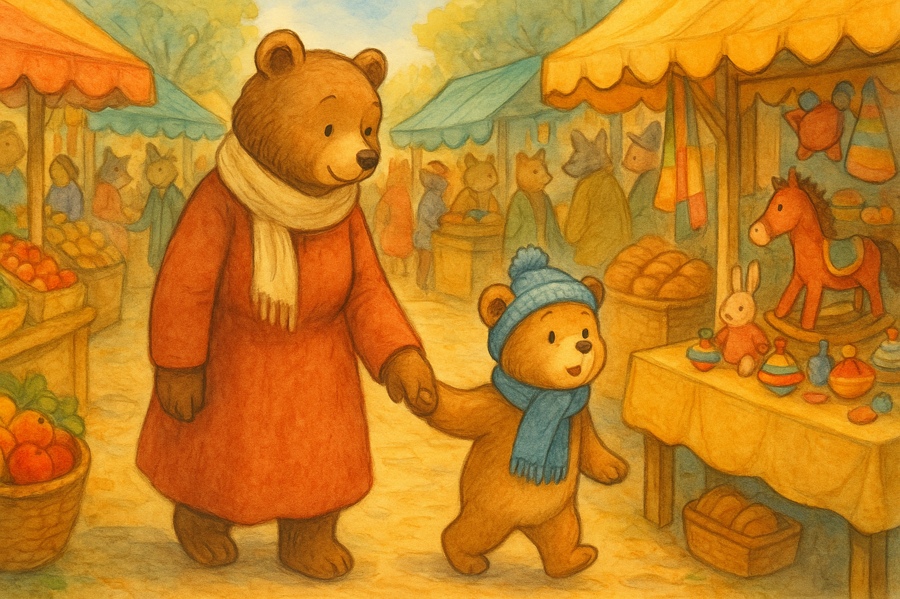

## 第二章 – 在摊位之间

城市的集市是一场色彩与香气的盛宴。  
摊位一个接一个地排列着，像一幅活生生的马赛克：一座座闪亮的红苹果塔，散发烤炉香气的热面包篮子，随风摇曳的布料像风帆一样。

奇里洛走在熊妈妈身旁，眼睛睁得大大的，头不停地左右转动，想把每一个细节都记在心里。  
突然，他看见了让他心头一震的东西：**一个摆满木制玩具的摊位**。

那里有小火车、陀螺、木偶、鼓，甚至还有一匹涂成红色的摇马。  
奇里洛感到心脏怦怦直跳。

“妈妈！我要去看玩具！现在！”

> “等等，奇里洛，我们得先买面包和水果。”熊妈妈平静地回答，紧紧握着他的爪子。

但是奇里洛开始拉扯和踢腿。  
“不——！我现在就要玩具！”

熊妈妈试着分散他的注意力，但小熊实在太兴奋了。  
突然，他猛地一挣，**把自己的爪子从妈妈手里抽了出来**，冲进了人群。

> “奇里洛——！马上回来！”熊妈妈喊道，但她的声音被小贩的叫卖声和人群的喧哗淹没了。

奇里洛不停地跑啊跑，以为自己一定能找到那个玩具摊位。  
可是越往人群里钻，他就越发现自己认不出路。  
摊位看起来都不一样，但却又都一样。  
他的兴奋渐渐变成了一股小小的恐惧。

他停在广场中央。  
已经看不见熊妈妈了。  
不知道玩具摊位在哪里。  
而他周围的人群，就像一条河流，把他推来推去。

“哦，不……现在怎么办？”他想着，心跳得越来越快。

就在这时，一个低沉而沙哑的声音叫住了他：  
> “嘿，小家伙……你迷路了吗？”

奇里洛转过身。  
在他面前站着一只**高大威严的熊**，黑色的毛发，冷峻的目光。  
他穿着一件破旧的大衣，双手插在口袋里。

> “跟我来。我带你回家。我知道路。”

奇里洛犹豫了。  
那只熊的语气里有些让他不安的东西。  
可他孤身一人，不知道该怎么办。  
当太阳开始在摊位间慢慢落下时，他的小小冒险正要变成一件更加严重的事情。

